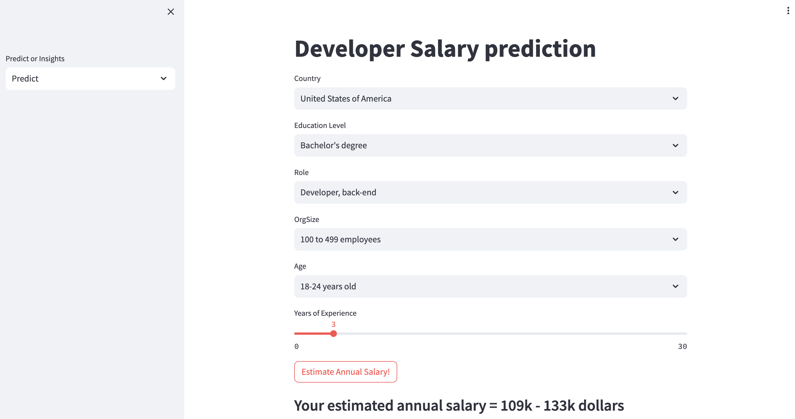

# salary-app
## Overview
This web app shows insights about developer salary and can predict devloper salary based on working info such as experience, country, and education level. The app consists of 2 pages (<code>predict_page</code> and <code>insights_page</code>). In <code>predict_page</code>, the annual salary of users can be estimated by input the working info. In <code>insights_page</code>, there are visualizations about developer salary and data distribution.  
## Dataset
The dataset (ver.2023) can be downloaded.  
https://insights.stackoverflow.com/survey
## Result
|Model|MAE|RMSE|MAPE|
|:---:|:---:|:---:|:---:|
|Linear Regression  |25907|35526|17.99|
|RandomForest       |27117|37974|20.69|
|LightGBM           |24585|34432|18.29|

The score was evalated by using 5-fold Cross Validation
## Deployment
### Local
```
docker build -t <image_name> .
docker run -p 8080:8080 <image_name>
```
### Google Cloud
```
gcloud builds submit --tag gcr.io/<PROJECT_ID>/<SOME_PROJECT_NAME> --timeout=1h
```
## App



